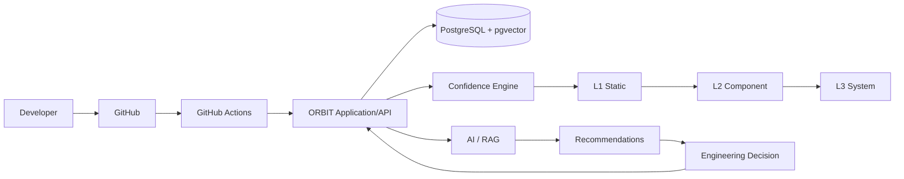

# ORBIT Solution Architecture Description

**Status:** Draft  
**Version:** 0.1  
**Last updated:** 2026-09-30

## 1. Purpose

ORBIT is a software delivery quality and decision-support platform that provides engineering teams with a consolidated view of software build quality, test evidence, confidence levels, and release readiness.

ORBIT integrates with the software development toolchain, collects engineering evidence, evaluates confidence, and supports engineers in deciding whether a software binary is ready to progress toward release. AI-assisted recommendations can identify areas where additional testing or investigation may provide value, while accountable engineering decisions remain with humans.

## 2. Architecture goals

ORBIT is designed to:

- provide a single view of software delivery confidence;
- integrate with existing source-control and CI/CD tooling;
- automatically collect and correlate build and test evidence;
- maintain traceability between source code, commits, builds, tests, recommendations, and decisions;
- support explicit quality gates between confidence levels;
- manage repository and quality policy increasingly as Configuration Management as Code;
- support AI-assisted test prioritization without making AI a prerequisite for core operation;
- provide deterministic development and demo workflows without external AI-provider costs;
- provide auditable human decisions; and
- scale toward multiple repositories, teams, and products.

ORBIT acts as a quality intelligence and decision-support layer rather than replacing existing CI/CD systems.

## 3. System context

The primary information flow is:

**Developer → GitHub → GitHub Actions → ORBIT → Confidence Assessment → Engineering Decision**

Developers work through Git and GitHub. GitHub Actions executes CI workflows and produces build and test evidence. ORBIT consumes and stores this evidence, correlates it with repositories and builds, evaluates confidence, and exposes the result through dashboards and APIs.

External AI services are optional and can analyze accumulated engineering evidence to generate testing recommendations.

## 4. Logical architecture

### 4.1 Web application

The ORBIT web application is implemented with Next.js and TypeScript and provides views for repository configuration, builds, confidence, evidence, recommendations, AI assistance, and operator administration.

### 4.2 Application services and API

Server-side services provide repository management, build ingestion, evidence management, confidence calculation, gate evaluation, recommendation management, authentication and authorization, GitHub integration, and AI-provider integration.

### 4.3 Persistence and background processing

PostgreSQL is ORBIT's primary persistent store. Ordered database migrations control schema evolution. A worker boundary supports durable background processing.

## 5. GitHub integration

GitHub is the current source-code-management integration. ORBIT uses a GitHub App to establish controlled access to selected repositories.

The integration supports repository authorization and discovery, installation-based access, webhook delivery, and explicit repository enablement. Webhooks provide event-driven integration so ORBIT can react to repository and delivery events without relying exclusively on polling.

## 6. CI/CD integration

GitHub Actions provides CI execution.

Typical flow:

**Code change → Pull Request → GitHub Actions → Build → Analysis and Tests → Evidence → ORBIT → Confidence Evaluation**

GitHub Actions executes engineering workflows. ORBIT aggregates and interprets their results, preserving separation between CI execution and higher-level quality intelligence.

## 7. Confidence model

A binary progresses through increasing confidence as evidence becomes available.

### Level 1 – Static confidence

Typical evidence includes successful build, compilation, linting, static analysis, dependency checks, and security scanning.

### Level 2 – Component confidence

Typical evidence includes unit, component, service, API, and controlled integration tests.

### Level 3 – System confidence

Typical evidence includes system, end-to-end, regression, external integration, performance, and robustness testing in a representative environment.

## 8. Confidence gates

Transitions between confidence levels are controlled by gates:

**Binary → L1 Gate → L1 → L2 Gate → L2 → L3 Gate → L3**

A gate can evaluate required tests, pass/fail results, mandatory analysis, available evidence, unresolved defects, risk, and policy requirements.

Gate policies should increasingly be represented as Configuration Management as Code so that they are version controlled, reviewed, validated, auditable, reproducible, and reversible.

## 9. Data architecture

PostgreSQL stores ORBIT state and engineering evidence, including repositories, builds, commits, evidence, test results, confidence states, recommendations, recommendation decisions, test actions, AI evidence, and AI recommendation runs.

Schema evolution is controlled through versioned migrations.

## 10. AI and RAG architecture

AI is optional decision support and does not make autonomous release decisions.

A Retrieval-Augmented Generation flow can use engineering evidence as follows:

**Engineering Evidence → Extraction/Chunking → Embeddings → Vector Search → Relevant Context → LLM → Recommendation**

PostgreSQL with pgvector provides vector-storage capability for engineering evidence.

## 11. AI provider abstraction

AI functionality is isolated behind a provider abstraction:

**ORBIT → AI Provider Interface → AI Provider**

The current architecture can use an OpenAI-backed provider while allowing alternatives later. AI-provider failure or unavailability must not prevent core build, evidence, confidence, and recommendation-lifecycle functionality from operating.

## 12. Recommendation workflow

Recommendations are advisory and follow a controlled lifecycle:

**Evidence → Recommendation → Pending → Human Decision → Test Action → Test Outcome → New Evidence**

A recommendation can be accepted, rejected, or deferred. Decisions and subsequent test outcomes are recorded for traceability and future learning.

## 13. Demo mode

ORBIT supports a deterministic demo workflow that does not require an external AI provider. This supports development, demonstrations, automated testing, onboarding, and cost-controlled environments while exercising the recommendation lifecycle.

## 14. Security architecture

ORBIT follows least-privilege principles. Key controls include GitHub App authentication, installation allowlisting, explicit repository enablement, protected webhook secrets, operator authentication, server-side authorization, environment-managed secrets, and protected AI-provider credentials.

Sensitive credentials must not be committed to source control.

The current operator boundary should evolve toward individual identities and role-based access control, for example Viewer, Developer, Maintainer, and Administrator roles.

## 15. Deployment architecture

The primary runtime structure is:

**Browser → ORBIT Next.js Application/API → PostgreSQL + pgvector**

External integrations are:

- GitHub and GitHub Actions;
- an optional AI provider.

Development environments can run ORBIT and PostgreSQL using containerized development infrastructure.

## 16. Development workflow

The intended engineering workflow is:

**Linear backlog item → Git branch → Implementation → Local quality gates → Commit/Push → Pull Request → GitHub Actions → Review → Merge to main**

Database, application, configuration, and architecture changes remain traceable through source control and backlog items.

## 17. Observability and auditability

ORBIT should retain enough information to reconstruct why a confidence state, gate result, or recommendation existed at a point in time.

Important audit relationships include repository, commit, build, workflow execution, test result, evidence, confidence state, gate result, recommendation, recommendation evidence, human decision, test action, and test outcome.

## 18. Configuration Management as Code

Operational and quality configuration should progressively move from manually managed settings into version-controlled configuration.

Candidate configuration includes repositories, build definitions, confidence levels, confidence gates, required evidence, test policies, risk thresholds, AI policies, and recommendation policies.

Target flow:

**Configuration change → Git commit → Pull Request → Validation → Review → Merge → ORBIT configuration update**

## 19. Architecture principles

**Evidence before opinion.** Engineering decisions should be grounded in traceable evidence.

**Human decision authority.** AI supports engineers; it does not replace accountable engineering decisions.

**Automation by default.** Evidence collection and confidence calculation should require minimal manual intervention.

**Configuration as Code.** Policies and system configuration should increasingly be version controlled.

**Traceability by design.** Builds, evidence, recommendations, decisions, and outcomes should be correlated.

**Loose integration coupling.** External systems should be accessed through defined integration boundaries.

**Graceful degradation.** Optional capabilities such as AI must not disable ORBIT's core functions.

## 20. Architecture overview

## 21. Architecture summary

ORBIT provides a centralized quality and confidence layer over the existing software development toolchain.

GitHub manages source code and collaboration. GitHub Actions performs CI execution. PostgreSQL stores engineering evidence and ORBIT state. ORBIT correlates this information into builds, evidence, confidence levels, gates, and recommendations.

The optional AI/RAG capability analyzes engineering evidence and recommends where additional testing may provide value. Human engineers remain responsible for accepting recommendations and making release decisions.

The resulting architectural chain is:

**Source Change → Build → Test Evidence → Confidence → Recommendation → Engineering Decision → Release**
